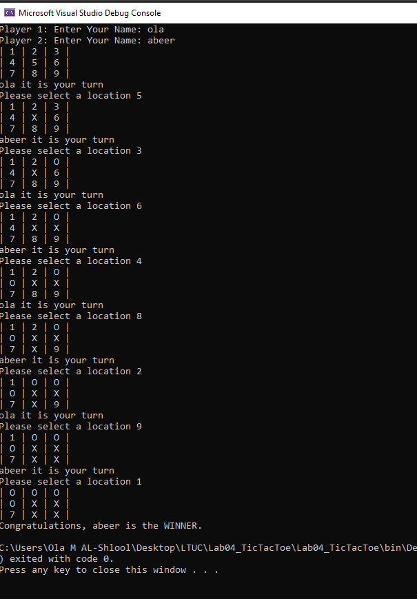

# Lab04-TicTacToe

### Description
This project holds a minigame built in C# on a .NET console app. 
The purpose is to allow two users to play a tic tac toe game that will determine a winner or a draw.

### How do you run the program?
1. Clone repo to your device.
2. Open the solution file Lab04_TicTacToe.sln in Visual Studio.
3. To run the app, go to Debug > Start Without Debugging (or press ctrl+F5).
### Using The Application
1. Upon starting the application, each player will be asked to enter their name, 
starting with player one. Once both players names have been entered, the game will begin.
2. Each turn, the player will need to select a number between 1 and 9 to place a marker onto the game board. 
The player will continue to be prompted for input until they enter a valid position that hasn't already been taken.
3. After each turn is taken, the board is updated to reflect the current state of the game. 
Once a player wins by placing three markers in a row, or all of the positions on the board have been taken, 
the game will end.
### Output Visual
